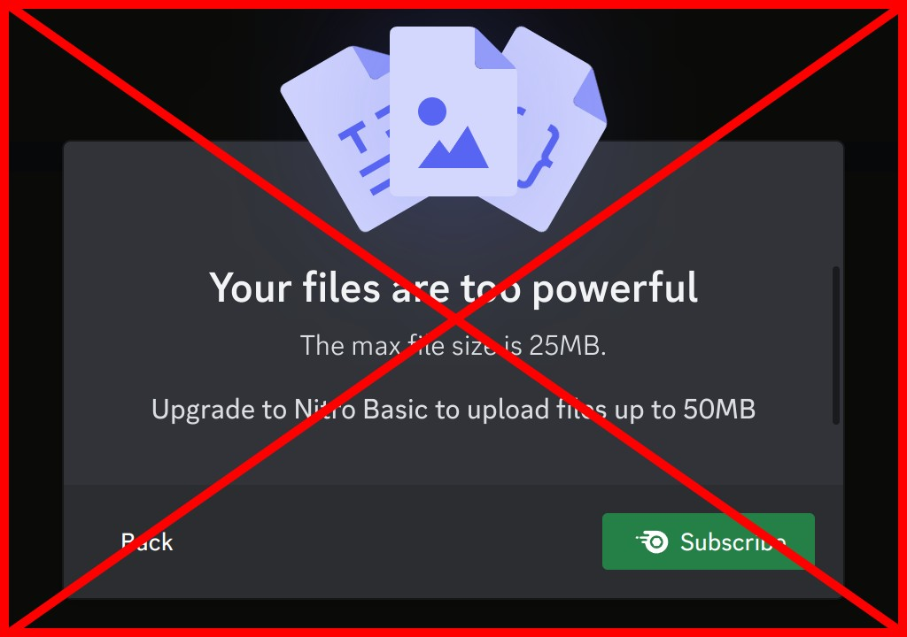

> ⚠️Yeah i know discord actually increased the limit to 25mb recently and thus this project is no longer relevant, but it sure was fun.⚠️

# Not too powerful




> Discord bot to send powerful images

## **[LINK](https://not-too-powerful.zenhalab.com/)**

## **☕ Usage**

```yaml
# Required
- The owner must add the bot to the server

# Once in any member can:
- Log in
- Choose the server and channel
- Select and send the image
```

</br>
</br>

## 🦩 **Why?**

### **Discord 8mb limit, and 4k screenshots**

Basically the file limit on discord prevent files bigger than 8mb to be uploaded, and that affects especially people with 4k monitors. So what ends up happening is that when i take a screenshot with half my screen size the result is usually around 10mb, thus discord blocks me from sending the image.

</br>
</br>

## **🚀 About**

### Discord and DiscordAuth:

To work with discord i had to setup a backend due to sensitive keys that are required to work with [discord api's ](https://discord.com/developers/docs/intro)

### Image processing:

First the image is preprocessed with [compressorJS](https://www.npmjs.com/package/compressorjs) on the frontend then it is
send to the api where it is processed again and converted
to webp and it's size its made sure to be less than 8mb with [sharp](https://www.npmjs.com/package/sharp)

### Frontend:

-Front end was made with spa in mind using [viteJS](https://vitejs.dev/), typescript and [react-router](https://reactrouter.com/en/main)

-State management and requests are handled with [redux and reduxQuery](https://redux-toolkit.js.org/)

-For the UI, [MaterialUI](https://mui.com/) is used

### 🍭 Infra

Now the **Real** reason behind this project was to learn about infrastructure, and well i've deployed this project in three different ways that we can list here

> ##### They are separated by tags

- [Aws managed ECS deploy](https://github.com/vzsoares/not-too-powerful/releases/tag/aws-ecs-deploy)

  - This was the first deploy, here i made it as fast as i could, so i set up a working `docker` image with `express` running and serving every thing.
    <br/>
    <br/>
    This strategy is just too expensive, but the deploy and maintenance is just too easy

- [Aws EC2 deploy](https://github.com/vzsoares/not-too-powerful/releases/tag/ews_ec2_deploy)

  - Now it got serious, because now i had to provision and manage the vm, so still using the docker image i now also needed more stuff.
    <br/>
    <br/>
    For example to open the right port with safety i used `nginx` and `docker compose`
    <br/>
    <br/>
    But i also needed to provision and manage the machine, so for that i used `ansible`, one script to provision and another to update the service.
    <br/>
    <br/>
    This approach is definitely cheaper but also much much harder to do.

- [Aws Lambda serverless deploy](https://github.com/vzsoares/not-too-powerful/releases/tag/aws-serverless-deploy)
  - And finally i decided to go serverless because it's simply cheap, and with the help of `serverless`, it was actually simple to deploy the api's
    <br/>
    <br/>
    The webpage was also very easy to deploy using aws `s3` and `cloudfront` combination
    <br/>
    <br/>
    So considering the price that's basically free due to aws free tier, this is the deployment i choose to keep the project
